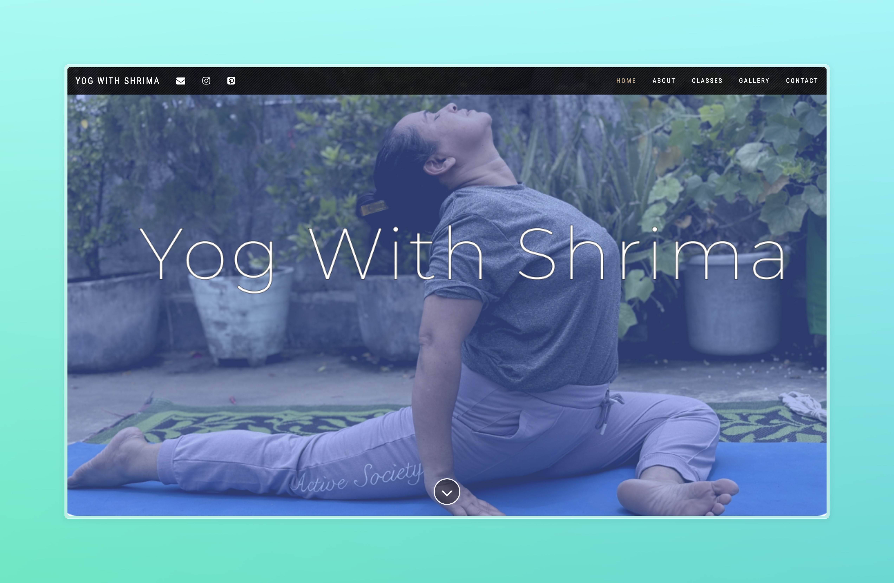

# Yog With Shrima

This is a simple website for my mom's yoga classes.

## Preview

## Technologies Used

- HTML
- CSS
- JavaScript

## Getting Started

To get started with this project, follow these steps:

1. Clone the repository.
2. Open the `index.html` file in your web browser.

## License

This project is licensed under the [MIT License](LICENSE).

## Contact

For any questions or inquiries, please contact [yogwithshrima@gmail.com].
